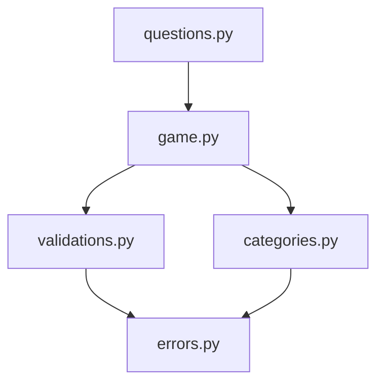

# Ahorcado en Python

Juego del ahorcado desarrollado en Python como trabajo práctico de programación - UNLP.
Incluye sistema de puntaje, categorías de palabras y rondas sin repetición.

## Funcionalidades

- Validación de entradas inválidas
- Sistema de puntaje por partida
- Selección de categoría al inicio
- Rondas sin repetición de palabras usando `random.sample()`

## Estructura del proyecto
```
Actividad/
    questions.py     — arranca el juego
    game.py          — lógica principal
    categories.py    — categorías y selección
    validations.py   — validación de entradas
    errors.py        — errores personalizados
```

## Diagrama de módulos


## Cómo correrlo
```bash
python questions.py
```

## Reglas de puntaje

- Letra incorrecta: -1 punto
- Adivinar la palabra: +6 puntos
- Perder: 0 puntos

## Autor

Nombre:  Leandro Benjamin Lopez  
Número de legajo: 028122/8

