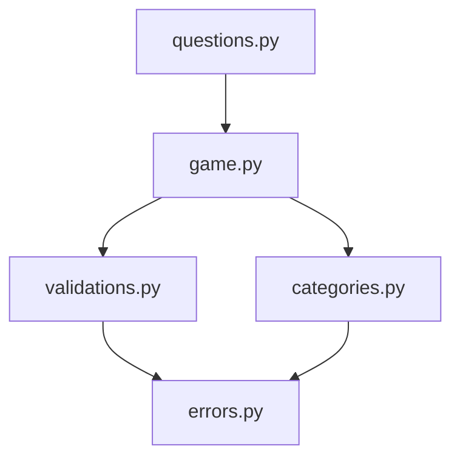
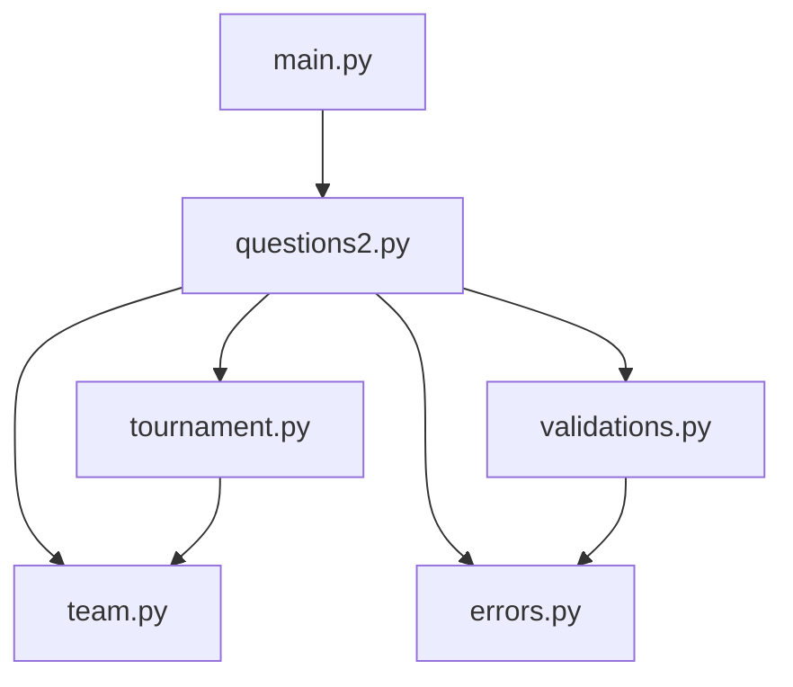
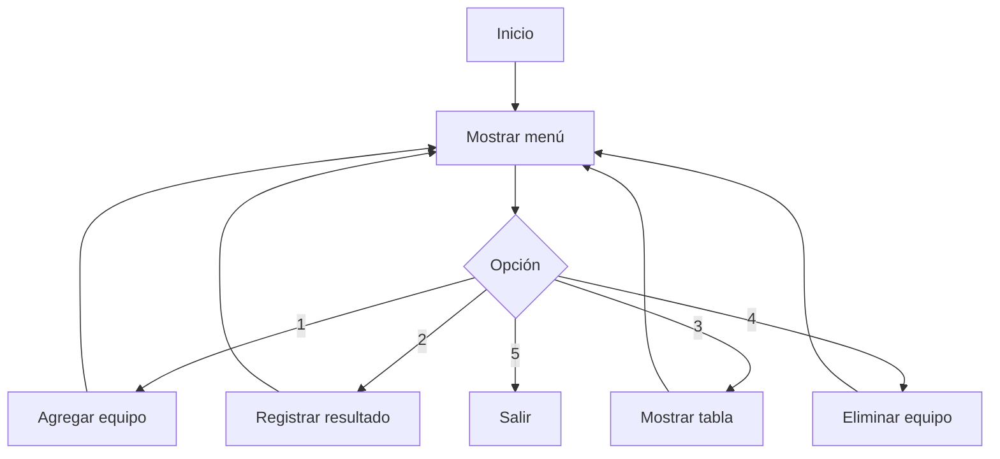

# Ahorcado en Python

Juego del ahorcado desarrollado en Python como trabajo práctico de programación - UNLP.
Incluye sistema de puntaje, categorías de palabras y rondas sin repetición.

## Funcionalidades

- Validación de entradas inválidas
- Sistema de puntaje por partida
- Selección de categoría al inicio
- Rondas sin repetición de palabras usando `random.sample()`

## Estructura del proyecto
```
Actividad/
    questions.py     — arranca el juego
    game.py          — lógica principal
    categories.py    — categorías y selección
    validations.py   — validación de entradas
    errors.py        — errores personalizados
```

## Diagrama de módulos


## Cómo correrlo
```bash
python questions.py
```

## Reglas de puntaje

- Letra incorrecta: -1 punto
- Adivinar la palabra: +6 puntos
- Perder: 0 puntos

markdown# Actividad Extra — Simulador de Torneo de Fútbol

Simulador de tabla de posiciones de un torneo de fútbol desarrollado en Python como actividad extra - UNLP.
Permite agregar equipos, registrar resultados y mostrar la tabla ordenada por puntaje.

## Funcionalidades

- Menú interactivo con 5 opciones
- Agregar equipos desde una lista predefinida
- Registrar resultados con actualización automática de puntos (3 victoria, 1 empate, 0 derrota)
- Tabla de posiciones ordenada de mayor a menor puntaje
- Eliminar equipos del torneo
- Validación de entradas con errores personalizados

## Estructura del proyecto
```
Actividad Extra/
    main.py          — punto de entrada
    questions2.py    — menú y flujos principales
    tournament.py    — clase Tournament
    team.py          — clase Team
    validations.py   — validaciones de entrada
    errors.py        — errores personalizados
```

## Diagrama de módulos


## Diagrama de flujo del menú


## Cómo correrlo
```bash
python main.py
```

## Reglas de puntaje

- Victoria: 3 puntos
- Empate: 1 punto
- Derrota: 0 puntos

## Nota sobre commits

Esta actividad fue desarrollada de forma incremental pero sin un commit por cada funcionalidad agregada como se hizo en la actividad principal. Los cambios principales fueron:

- Estructura inicial con clases `Tournament` y `Team`
- Implementación del menú interactivo
- Separación en módulos (`errors.py`, `validations.py`)
- Refactorización de validaciones con `ask_valid_input`
- Corrección de bugs en flujos de entrada (`add_team_flow`, `register_result_flow`)
- Formato de tabla de posiciones alineado


## Autor

Nombre:  Leandro Benjamin Lopez  
Número de legajo: 028122/8

